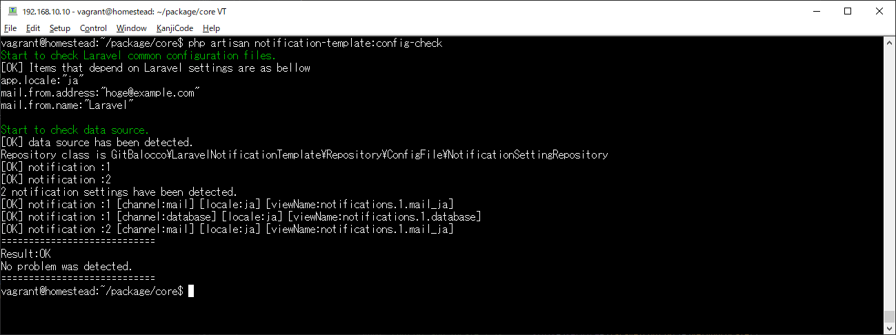
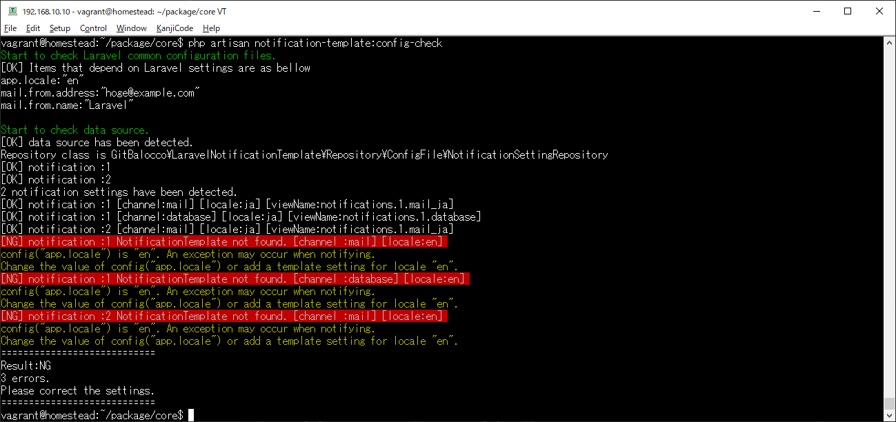
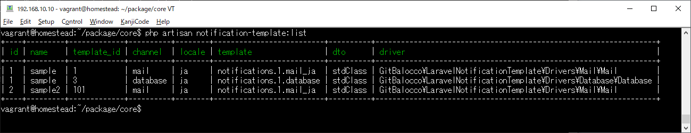

# Laravel notification template

A package that provides developer functionality that allows you to easily manage Laravel Notifications.  

Laravelの通知（Notification）を簡単に管理することができる、開発者用の機能を提供するパッケージです。

## 使い方 Usage
### 最も単純な送信例 The simplest example
```php usage1.php
//Find user id:99 (or any other Notifiable entity)
$user = \App\Models\User::findOrNew(99);

//Create TemplatedNotification instance with notification_id.
$notification = new \GitBalocco\LaravelNotificationTemplate\TemplatedNotification(1);

//Send notification:1 to user:99. 
$user->notify($notification);
```

### テンプレートに変数をアサインして送信する例 Example of assigning a variable to a template and sending it 
```php usage2.php
//Find user id:99 (or any other Notifiable entity)
$user = \App\Models\User::findOrNew(99);

//Create TemplatedNotification instance with notification_id 2.
$notification = new \GitBalocco\LaravelNotificationTemplate\TemplatedNotification(2);
//Create a DTO to assign to the template
$dto = new \stdClass();
$dto->name = 'Yoshiki';
$dto->part = 'Drums';
$dto->status = 'Melancholy';

//Assign DTO to templates.(In this example, assign to all locales and channels)
$notification->assignToAll($dto);

//Send notification:2 to user:99. 
$user->notify($notification);
```

## 設定 Settings
In this package, the contents to be sent are managed by the configuration file. The settings consist of two types of entities: "notifications" and "templates".
The relationship between "notification" and "template" is 1 to N. Different templates are available for each combination of "channel" and "locale" for one type of notification.

このパッケージでは、設定ファイルによって送信内容の管理を行います。設定は、「通知」と「テンプレート」の2種類のエンティティにより構成されます。
「通知」と「テンプレート」の関係は1対Nです。1種類の通知に対して、Channel、Locale の組み合わせごとに異なるテンプレートを利用可能です。

### Channel
Laravel supports a large number of channels.  
https://laravel.com/docs/8.x/notifications#specifying-delivery-channels  

However, at this time this package only supports some channels. Please refer to [SupportedChannelList.php](./src/ValueObject/SupportedChannelList.php) for the specific contents of the channels supported by this package.

Laravelは多数のチャンネルをサポートしています。  
https://readouble.com/laravel/8.x/ja/notifications.html#specifying-delivery-channels  

ですが、現時点でこのパッケージがサポートしているのは、そのうち一部のチャンネルのみです。このパッケージがサポートしているチャンネルの具体的内容は、[SupportedChannelList.php](./src/ValueObject/SupportedChannelList.php)を参照して下さい。

### Configuration file skeleton

The template of the configuration file is shown below.  

以下に、設定ファイルの雛形を示します。

```php
return [
    'notification_settings' => [
        [
            /** @var int notification_id (required) */
            'id' => 1,
            /** @var string notification name (required) */
            'name' => '',
            /** @var array (required) */
            'notification_templates' => [
                /** @var int template id.(required) */
                'id' => 1,
                /**
                 * @var string channel name.(required)
                 * @see \GitBalocco\LaravelNotificationTemplate\ValueObject\SupportedChannelList
                 */
                'channel' => '',
                /** @var string / required */
                'locale' => '',
                /** @var string view name that actually exists.(required) */
                'viewName' => '',
                /** @var string dto class name that actually exists.(optional default:stdClass) */
                'dtoClass' => '',

                /**
                 * @var string driver class name that actually exists
                 * optional default : decided by channel
                 * @see \GitBalocco\LaravelNotificationTemplate\ValueObject\NotificationChannel::defaultDriverClassName()
                 * driver has a fixed interface to be implemented for each channel.
                 * @see \GitBalocco\LaravelNotificationTemplate\ValueObject\NotificationChannel::driverInterfaceName()
                 */
                'driver' => '',

                /** @var string subject(optional) Valid only if the channel is "mail" */
                'subject' => '',
                /** @var array from(optional) Valid only if the channel is "mail" */
                'from' => [
                    /** @var string mail address.Only RFC-compliant email addresses can be specified. */
                    'address' => '',
                    /** @var string mail name. */
                    'name' => ''
                ],
            ],
        ]
    ]
];
```

## コマンド Commands

このパッケージをインストールすると、2つのartisanコマンドが追加されます。

### notification-template:config-check
設定ファイルの内容を検証するコマンドです。設定ファイルに何らかの問題がある場合、問題点を画面に出力します。チェック成功時に0、失敗時に1以上を返します。

チェック成功時  


チェック失敗時  


### notification-template:list

設定ファイルに記述されているテンプレートの基本的な設定内容を一覧表示します。




## カスタマイズ Customize

送信処理のカスタマイズについて、以下に詳述します。

### 手順(1) ドライバクラスの作成

#### インターフェースについて

送信処理を担当するdriverを作成します。driverクラスは、channelごとに定められたInterfaceを実装して下さい。

| channel  | Interface             | Example(package default driver)                              |
| -------- | :-------------------- | ------------------------------------------------------------ |
| mail     | MailChannelDriver     | GitBalocco\LaravelNotificationTemplate\Drivers\Mail\Mail     |
| database | DatabaseChannelDriver | GitBalocco\LaravelNotificationTemplate\Drivers\Database\Database |

※[SupportedChannelList.php](./src/ValueObject/SupportedChannelList.php) 参照。

#### コンストラクタ引数

driverのコンストラクタには、$config、アサインされた$dtoObject、$notifiableの3点が渡されます。コンストラクタ引数は変更できません。また、これら3点を取り扱うゲッタは、ChannelDriverTrait を利用してください。

#### build() メソッドの実装

カスタマイズする送信処理本体を、build() に実装して下さい。

#### カスタマイズ例1（database channel）

```php
use GitBalocco\LaravelNotificationTemplate\Drivers\Database\Contracts\DatabaseChannelDriver;
use GitBalocco\LaravelNotificationTemplate\Drivers\Traits\ChannelDriverTrait;
use GitBalocco\LaravelNotificationTemplate\Entity\NotificationTemplate\DefaultSetting;

class CustomDatabaseDriver implements DatabaseChannelDriver
{
    use ChannelDriverTrait;

    /**
     * CustomDatabaseDriver constructor.
     * @param DefaultSetting $config
     * @param mixed $dtoObject
     * @param mixed $notifiable
     */
    public function __construct(DefaultSetting $config, $dtoObject, $notifiable)
    {
        $this->config = $config;
        $this->dtoObject = $dtoObject;
        $this->notifiable = $notifiable;
    }


    /**
     * @return array
     * @throws Throwable
     */
    public function build(): array
    {
		//ここにカスタマイズ処理を実装
    }
}
```


#### カスタマイズ例2（mail channel）

```php
use GitBalocco\LaravelNotificationTemplate\Drivers\Mail\Contracts\MailChannelDriver;
use GitBalocco\LaravelNotificationTemplate\Drivers\Traits\ChannelDriverTrait;
use GitBalocco\LaravelNotificationTemplate\Entity\NotificationTemplate\MailSetting;
use Illuminate\Mail\Mailable;

/**
　* メールチャンネルの場合、Mailableを継承し、build() から$this を return する
　*/
class CustomMailDriver extends Mailable implements MailChannelDriver
{
    use ChannelDriverTrait;

    /**
     * CustomMailDriver constructor.
     * @param MailSetting $config
     * @param mixed $dtoObject
     * @param mixed $notifiable
     */
    public function __construct(MailSetting $config, $dtoObject, $notifiable)
    {
        $this->config = $config;
        $this->dtoObject = $dtoObject;
        $this->notifiable = $notifiable;
    }

    /**
     * @return $this
     */
    public function build(): Mailable
    {
        //カスタマイズ処理を実装
        
        //mail チャンネルの場合、Mailableを返却する。※このパッケージは MailMessage には対応していません
        return $this;
    }
}
```

### 手順（2）設定ファイルへの追記

driverクラスを作成したら、設定ファイルの driver 項目に、クラス名を追記して下さい。

```php
/**
 * @var string driver class name that actually exists
 * optional default : decided by channel
 * @see \GitBalocco\LaravelNotificationTemplate\ValueObject\NotificationChannel::defaultDriverClassName()
 * driver has a fixed interface to be implemented for each channel.
 * @see \GitBalocco\LaravelNotificationTemplate\ValueObject\NotificationChannel::driverInterfaceName()
 */
'driver' => \Namespace\Of\Each\Project\CustomDatabaseDriver::class,
```


